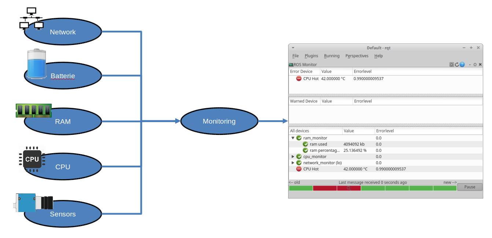

# ROS Monitoring

The ROS Monitoring Tools helps to analyse and improve ROS Systems. It collects information about the coputer, operating system and ros environment and filters them. All Values and detected Warnings and Errors can be visualised in a RQT Plugin.

# Overview

This tool is designed to collect and observe system values, detect and identify failures and to perform recovery when possible. It can handle a number of distributed Monitors. Some gernal Monitors are included within this package, for all other nodes libraries for C++ and Python exist to integrate the Monitoring into custom Nodes. 

All Monitoring-Data is aggregated and can be visualised by two different RQT-Plugins (a varriant of the ROS Monitor and the ROS Plot, modified to support Monitoring)

Besides visualisation, Faultdetection and Recovery are supported. 

## TODO NEW IMAGE
### Find Icons:

Icons need to be Free Licensed

Icons:

- CPU
- Memory
- Network
- Nodes
- Topics
- Frequencys
- Batteries
- Kameras
- Laserscanner
- Warning
- Error
- GUI Symbol

# Packages

The following packages are Included 

**monitoring_core:** other monitor use this pkg to add the value for topic /monitoring

**monitoring_visualization:** take the message form topic /monitoring and give it to GUI.User can see all the message in GUI window 

**monitoring_rqt:** plugin for rqt

**System monitor:** monitor for system,please see Documentation

**ROS monitor:** monitor for ROS,please see Documentation

**monitoring_fdir:** Fault detection and identification

**monitoring_bridge:** the bridge for Diagnostics

# Documentation

Documentation for monitor is here:

* [System monitor](https://ws02.rts.uni-hannover.de/monitoring/monitoring/tree/master/monitoring_monitors_system)

* [ROS monitor](https://ws02.rts.uni-hannover.de/monitoring/monitoring/tree/master/monitoring_monitors_ros)

* [monitoring_bridge](https://ws02.rts.uni-hannover.de/monitoring/monitoring/tree/master/monitoring_visualization)

* [monitoring_fdir](https://ws02.rts.uni-hannover.de/monitoring/monitoring/tree/master/monitoring_fdir)

# Installation

## Required:

The monitoring tolls are tested on:

- Jade
- Kinetik
- Melodic

To use all features the following packages are required.

    sudo apt install libprocps4-dev python-ntplib

## Build:

To build from source, clone the latest version from this repository into your catkin workspace and compile the package using

    cd catkin_ws/src
    git clone https://ws02.rts.uni-hannover.de/monitoring/monitoring.git
    cd ..
    catkin_make

# Tests:

Run tests with:

    catkin_make run_tests
    catkin_test_results

# Configuration

please see Documentation

# Usage

## Example

## Monitoring
The monitors all can be configure via a yaml-config files, you can find examples in the folder *config*.

You can write your own node. It is recommend to use the *include/ros_monitoring/monitors/monitormsg.h* interface

## Fault detection and identification
You can create your own FDI node with the SDK (*src/fdir/fdiSDK.cpp*). An example node is *src/fdir/fdiExample.cpp*

## Recovery
You can create your own Recovery node with the SDK (*src/recovery/recoverysdk.cpp*). An example implementation is *src/recovery/recoveryExample.cpp*

## GUI
There is a rqt plugin to visulaize the monitoring data. To use it, you need to start the *monitoring_visualization.launch*. This node aggregates all messages to send to a remote pc over the topic */monitoring/gui*. You can visualize the data with the *Monitor Viewer*

## Connect to Diagnostics
You can connect the monitoring systems to the diagnostics stack. There are two bridges. One for diagnostics to monitoring (node: *diagnostics_to_monitoring*) and one for monitoring to diagnostics (node: *monitoring_to_diagnostics*)

## Errorlevel
The Errorlevel is a value between 0.0 and 1.0 it can be any float value. They are further devided in 3 groups. Ok, Warn and Error states. Ok is between 0 and 0.35. Warn is till 0.7 and Error is till 1.0.

## Aggregation Strategies
When monitoring a Value, not all values are required to be transmitted. Therefore an aggregation Startegiy can be selected:

- MIN 
- MAX 
- FIRST
- LAST
- AVG

You can change the mode in every config file.
